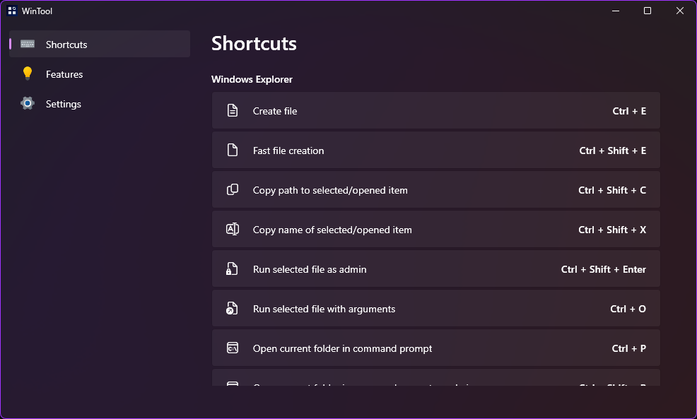
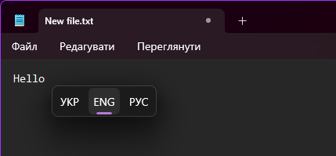

# WinTool

WinTool is a utility that adds useful features and shortcuts to Windows, enhancing everyday experience.

 

## Shortcuts
### Windows Explorer
- Run selected exe-file with arguments
- Create file
- Fast file creation
- Copy path to selected/opened item
- Copy name of selected/opened item
- Open current folder in cmd

## Features
- Keyboard layout switching popup near active caret in any app

## Related libraries
- [GlobalKeyInterceptor](https://github.com/arcanexhoax/GlobalKeyInterceptor) - a library used to intercept keyboard shortcuts
- [WpfConverters](https://github.com/arcanexhoax/WpfConverters) - a pack of WPF converters
