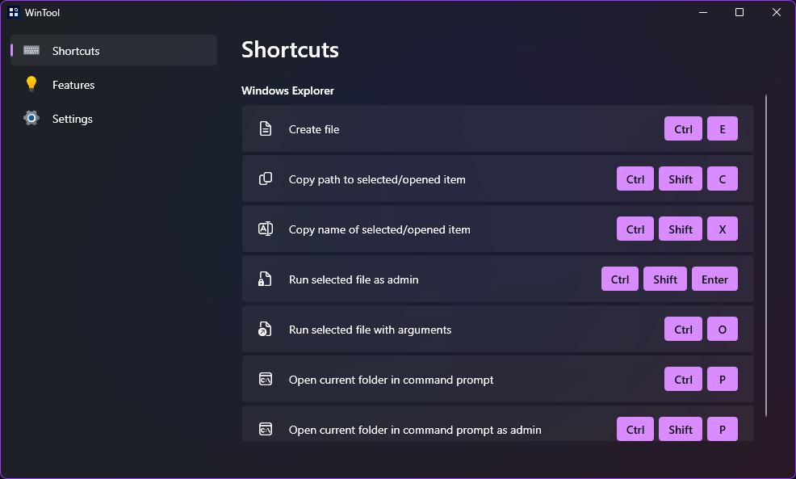
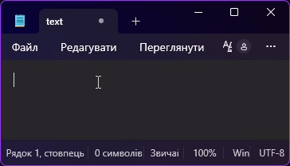

# WinTool

WinTool is a utility that adds useful features and shortcuts to Windows, enhancing everyday experience.

 

 

## Shortcuts
### Windows Explorer
- Create file
- Copy path to selected/opened item
- Copy name of selected/opened item
- Run selected file as admin
- Run selected file with arguments
- Open current folder in command prompt
- Open current folder in command prompt as admin

 

## Features
- Input popup. Shows the current keyboard layout near the text cursor when you switch languages

 

## Related libraries
- [GlobalKeyInterceptor](https://github.com/arcanexhoax/GlobalKeyInterceptor) - a library used to intercept keyboard shortcuts
- [WpfConverters](https://github.com/arcanexhoax/WpfConverters) - a pack of WPF converters
